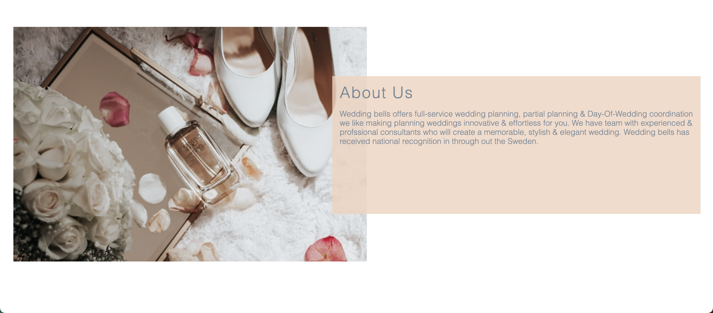
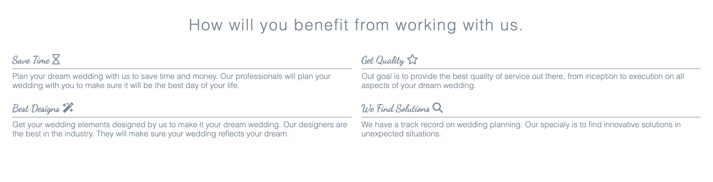
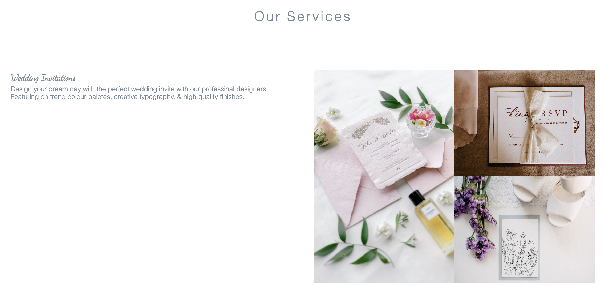
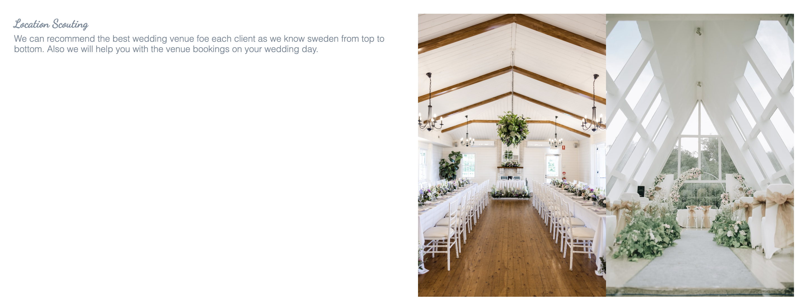
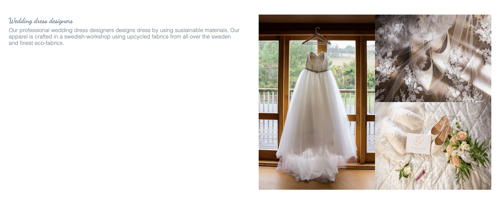
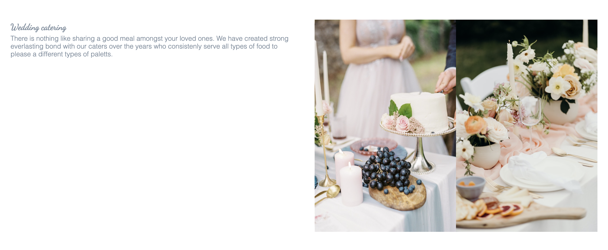
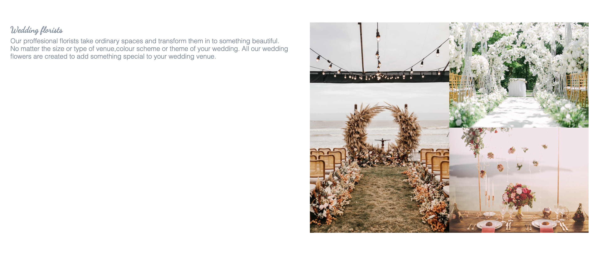

# Wedding Bells

Wedding bells is a site that provides services with a professional team to soon to be married couples to plan there wedding.
These services provides throughout the sweden.  
The site will be targeted towards couples who will be getting married soon.Who needs plan their wedding with a professional team.
Wedding bells will be useful to couples to plan their wedding without any stress.

## Features

### Existing Features
- Navigation bar
  - Featured on all three pages, full responsive navigation bar has links to logo, Home page, Service pages and get-in-touch form page.
all the links look identical so they allow for easy navigation.Also it includes a text called "wedding planner". 

  - This section will allow the user to easily naviagate from page to page across all devices.
  

  ### Page Banner
  - In this section includes a photograph of newly married couple to get a  quick idea about the website.
  

  ### About Us Section 
  - From this section user can get a clear idea about the website and get to what they do and where they based on.
  

  ### Benefits Section
  - In this section user can see what are the main benefits that they can get to plan their wedding by using this website.
  - User will see the benefits of using a professional team to their wedding day.
  

  ### Gallery
  - The gallery will provide the user with supporting images to see how are the weddings look like
  when  they took care by professional teams.
  Also users can get a quick idea of what kind of services can be provided.
  

  ### Footer
  - Footer section includes relevent social media to the wedding bells website.
  - The links will open to a new tab to allow easy navigation for the user.
  - Footer encourages user to stay conneted through socaial media.
  

  ## Our Services Page
  - From this page user can get a clear idea about what kind of services they provides
  in detailed.
  - They provides services for designing wedding invitation cards,
    booking wedding venues,wedding dress designs,wedding cateriing and
    wedding decoratins (flower arrangments).
  - This section also has a gallery to see in detail how their previous designs look like 
    in perticular services.
    
    
    
    
    
  
